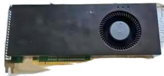
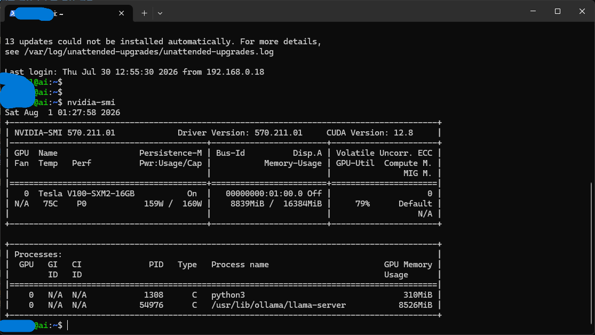

로컬 LLM을 돌리려고 중고 서버용 GPU를 알아본 적이 있다면 V100이 한 번쯤 눈에 들어왔을 거예요. 데이터센터에서 나온 물건이라 가격 대비 스펙이 좋아 보이지만, 막상 손에 쥐면 일반 그래픽카드와는 완전히 다른 물건이라는 걸 알게 됩니다. 냉각부터 전력, 드라이버 지원까지 서버용 GPU만의 함정이 따로 있어요. 실제로 **i3-9100 한 대에 헤놀로지 나스와 V100 AI 서버를 합쳐 Proxmox로 재구축**하면서 부딪힌 문제와 아직 다 풀지 못한 문제까지 정리했습니다.

## 왜 서버용 GPU는 일반 환경에서 말썽을 부릴까

이번에 쓴 카드는 정확히는 V100 **SXM2** 모듈입니다. SXM2는 애초에 PCIe 슬롯이 아니라 서버 전용 보드에 바로 실장하는 규격이라, 일반 PC에 물리려면 **SXM2→PCIe 변환보드**가 따로 필요해요. 그리고 SXM2 모듈도 **팬이 없습니다.** 설계 자체가 서버 섀시의 강제 흡배기를 전제로 하기 때문이에요. 랙 서버에 꽂으면 섀시 팬이 모듈 앞뒤로 바람을 밀어 넣어주는 구조라, 모듈 자체는 발열을 알아서 처리할 필요가 없습니다. 문제는 이 전제가 일반 PC 케이스에는 적용되지 않는다는 점이에요. 원래 설계가 "남이 식혀준다"는 가정 위에 서 있다는 걸 모르고 사면, 변환보드까지 구해 조립하고 나서야 이 사실을 깨닫게 됩니다.

## 문제 1 — 팬 없는 카드, 부하 걸리면 몇 분 만에 스로틀링

SXM2→PCIe 변환보드도 **팬이 없는 모델을 고르면** 일반 케이스에 그냥 꽂았을 때 **부하가 걸리고 몇 분 안에 스로틀링이 시작됩니다.** 모듈 자체 냉각 능력이 없으니 케이스 안의 미미한 공기 흐름만으로는 온도를 못 잡는 거예요. LLM 추론처럼 GPU를 지속적으로 쓰는 작업에서 특히 바로 티가 납니다.



그래서 지금 쓰는 건 **블로워 팬이 기본으로 달려 있는 변환보드 모델**입니다. 별도로 슈라우드를 만들거나 팬을 따로 달 필요 없이, 변환보드 자체가 모듈에 바람을 밀어 넣는 구조예요. 중고 V100을 SXM2+변환보드 조합으로 구할 때는 **변환보드에 블로워 팬이 기본 포함된 모델인지 먼저 확인**하는 게 나중에 냉각 문제로 고생하는 걸 막는 가장 쉬운 방법입니다.

## 문제 2 — 전력 제한, 소음보다 더 큰 문제였습니다

블로워 팬으로 바람길을 잡아도 V100 SXM2의 정격 소비전력(300W대)을 그대로 두면 발열도 소음도 여전히 부담스럽습니다. 여기서 쓸 수 있는 게 `nvidia-smi -pl` 명령으로 거는 전력 제한이에요.

그런데 이 값을 잡는 과정에서 소음보다 훨씬 심각한 문제를 만났습니다. **200W로 제한을 걸어뒀는데도 기록을 보니 순간 소비전력이 226W까지 올라간 적**이 있었고, 그 무렵 서버가 **원인 모르게 두 번 꺼졌습니다.** 한 번은 전원 버튼을 눌러도 반응이 없다가 **36분 뒤에야 저절로 다시 켜졌어요.** 소프트웨어가 낼 수 있는 증상이 아니어서, 정전·CPU 과열·PCIe 오류·ZFS 문제·케이스 과열을 하나씩 확인해 배제했습니다. 실측해보니 GPU는 최대 80도, 케이스 내부 공기 온도는 38도로 과열은 아니었어요. 배제하고 남은 유력한 용의자는 **파워서플라이의 과전류 보호(OCP) 회로가 걸렸다 풀리는 패턴**이었습니다.

임시로 **160W까지 낮췄더니 원인 모를 다운은 멈췄는데, 이번엔 작업 속도가 눈에 띄게 느려졌습니다.** 그래서 한동안 파워가 범인이라고 생각했어요.

**[2026-08-04 수정]** 아니었습니다. 진짜 원인은 **케이스 전원 스위치의 접점 불량**이었습니다. 메인보드에서 PWR SW 커넥터를 아예 뽑아버렸더니 그 뒤로 멀쩡히 돌고 있어요(켤 때는 드라이버로 핀 두 개를 순간 단락시킵니다). 스위치가 제멋대로 눌린 신호를 보내고 있었던 셈이라, 전력 제한을 낮췄을 때 다운이 멈춘 건 우연이었습니다.

여기서 남은 교훈이 있습니다. **로그가 한 줄도 안 남으면 소프트웨어 문제가 아닙니다.** 저는 배제법으로 좁힌 뒤 남은 것 중 가장 그럴듯한 쪽을 골랐는데, 그렇게 얻은 답이 늘 정답은 아니었어요. 물리 접점을 의심하기까지 시간이 더 걸렸습니다.

원인을 잡고 나서 전력 제한은 **200W로 되돌렸습니다.** 지금은 온도에 따라 자동으로 조절해요. 82도를 넘으면 150W로 내리고, 70도 아래로 내려오면 200W로 복귀시키는 스크립트를 걸어뒀습니다. 아래 명령으로 실제 병목이 전력 제한인지 확인할 수 있습니다.

```bash
nvidia-smi -q -d PERFORMANCE | grep -A 12 "Clocks Event Reasons"
# "SW Power Cap: Active"가 자주 뜨면 제한값이 실제 병목이라는 뜻
```



전력 제한값 하나 걸어두면 끝나는 문제가 아니었습니다. 순간 전력이 어디까지 튀는지, 그게 실제 다운의 원인인지까지 데이터로 확인해야 하는 작업이었어요. "제한값이 곧 실제 소비전력"이라고 믿고 넘어가면 원인을 못 찾고 헤맬 수 있습니다.

## 문제 3 — 재부팅하면 전력 제한이 초기화됩니다

`nvidia-smi -pl`로 전력 제한을 걸어도 **재부팅하면 정격값(300W대)으로 돌아갑니다.** 직접 겪고 나서야 안 함정이에요. 서버를 며칠 켜두다 예기치 않게 재부팅되면 전력 제한이 풀린 채로 다시 부하가 걸리고, 그러면 앞서 잡아둔 발열·소음 문제가 그대로 재발합니다.

해결법은 부팅 시점에 전력 제한을 자동으로 다시 걸어주는 **systemd 서비스 등록**입니다. 부팅 후 `nvidia-smi -pm 1`(지속 모드)과 `nvidia-smi -pl [설정값]`을 함께 실행하는 서비스 유닛을 하나 만들어 활성화해두면, 값을 몇 W로 바꾸든 재부팅 이후 매번 수동으로 명령을 칠 필요가 없어집니다. 지금처럼 전력 제한값을 계속 조정해가는 단계에서는 이 자동화를 먼저 걸어두는 게 시행착오를 줄여줍니다.

## 의외의 장점 — 세대는 오래됐는데 체감은 좋습니다

여기까지 보면 손이 많이 가는 카드처럼 보이지만, 로컬 LLM 용도로는 의외의 장점이 있습니다. V100은 **HBM2 메모리 대역폭이 900GB/s**로, 요즘 보급형 카드인 RTX 4060의 대역폭(약 272GB/s)보다 **3배 이상** 높습니다. LLM 토큰 생성은 연산량보다 메모리 대역폭에 성능이 좌우되는 영역이라, 아키텍처 세대가 오래됐어도 실제 체감 속도는 기대 이상이었어요. 앞서 본 화면에서도 `llama-server` 프로세스가 GPU 메모리를 8.5GB가량 점유한 채 79% 사용률로 안정적으로 돌고 있었습니다.

다만 이 장점에는 유효기간이 있습니다. V100은 **Volta 세대(연산 능력 7.0)**인데, **CUDA 13부터는 Volta의 오프라인 컴파일과 라이브러리 지원이 빠졌습니다** (출처: [NVIDIA CUDA 13.0 릴리즈 노트](https://docs.nvidia.com/cuda/archive/13.0.1/cuda-toolkit-release-notes/index.html#deprecated-architectures)). 최신 PyTorch도 마찬가지라, 지금은 **드라이버 570.x 계열 + CUDA 12.x + PyTorch cu126 빌드**로 버전을 통째로 고정해서 씁니다. 최신 버전을 깔면 설치 자체는 되는데, 정작 실행할 땐 **"GPU는 인식하는데 연산 커널이 없다"는 오류**가 뜨는 게 가장 헷갈리는 지점이었어요. 이런 증상을 만나면 하드웨어 고장이 아니라 **아키텍처 지원이 끊긴 것**을 먼저 의심하면 됩니다. 중고 서버 GPU를 살 때는 "언젠가 지원이 끊긴다"는 것까지 가격에 포함해서 판단하는 게 맞습니다.

## 용도를 나누세요 — 미디어 서버는 내장 그래픽, AI는 GPU 전담

집에서 서버를 하나로 굴리다 보면 GPU에 여러 일을 몰아주고 싶어지는데, V100에는 이걸 말리는 이유가 하나 더 있습니다. V100은 Volta 아키텍처라 **BF16 텐서 코어와 FP8 가속을 지원하지 않습니다.** 이 두 정밀도는 각각 Ampere, Hopper 세대부터 들어간 기능이에요. 그래서 이미지·영상 생성 계열 모델을 V100에 그대로 올리면 **검은 화면이나 NaN(연산 불능값) 출력이 나는 경우**가 있었고, `--force-fp16` 옵션으로 강제 전환해야 정상 동작했습니다. 같은 이유로 **FlashAttention-2도 동작하지 않아** 기본 어텐션 구현으로 돌려야 했고요.

그래서 지금 구성은 역할을 나눠뒀습니다. Jellyfin 같은 미디어 서버의 트랜스코딩은 **내장 그래픽(QSV)에 맡기고, V100은 Ollama 전용으로만 씁니다.** 내장 그래픽이 영상 트랜스코딩에는 전력 효율이 더 좋기도 하고, GPU 하나에 여러 워크로드를 걸면 정밀도 문제로 디버깅할 일이 늘어나는 걸 직접 겪었기 때문입니다.

## 정리

중고 V100은 가격만 보면 매력적이지만, 실제로는 **블로워 팬이 달린 SXM2 변환보드를 골라 냉각을 해결하고, 전력 스파이크가 서버 다운으로 이어지는지까지 확인하고, 재부팅마다 초기화되는 설정을 자동화하는** 작업이 뒤따릅니다. 그 수고를 감수할 만한 이유는 HBM2 대역폭이 주는 체감 성능이고, 감수해야 할 한계는 언젠가 끊길 드라이버 지원과 최신 정밀도 포맷 미지원입니다. **[2026-08-04 수정]** 참고로 저는 이 글을 처음 쓸 때까지 원인 모를 다운을 전력 문제로 의심하고 있었는데, 결국 범인은 케이스 전원 스위치의 접점 불량이었습니다. 지금은 200W에 온도 연동 조절을 걸어두고 안정적으로 돌고 있어요. 엉뚱한 곳에서 원인이 나올 수 있다는 것까지가 이 카드를 쓰며 배운 것입니다. 사기 전에 이 편차를 알고 있으면, 조립하고 나서 당황할 일은 줄어듭니다.
